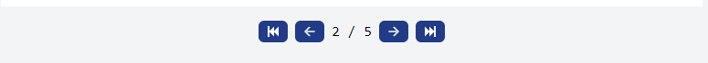

# ElelisPage

Elelispage es un portafolio donde exponer informacion de estudios y abilidades personales.

## Blog

### Cabecera

Cada publicación del blog se debe guardar en un formato `Markdown` en la carpeta `./src/content` con el siguiente formato de cabecera:

```sh
---
id: title_post
title: Title Post
description: desc
date: Month day, year hour
categories: ['CAT1', 'CAT2']
modified_date: Month day, year hour
---

content...
```

### Categorias

Las categorias en la cabecera deben estar registradas en `src/utils/Categories.json` con la siguiente estructura

```JSON
{
    "CAT1": "cat1"
    ...
}
```

### Páginas

Para que un post tenga varias paginas se debe agregar `---Page` en el documento *Markdown* la cantidad de paginas que se desean donde debe hacer la división.



### Función de cargar contenido

Al tener la publicación terminada ejecutar el comando cargará la publicación en el blog:

```sh
npm run serve
```

### Función de Deploy

Para publicar el blog:

```sh
npm run deploy
```